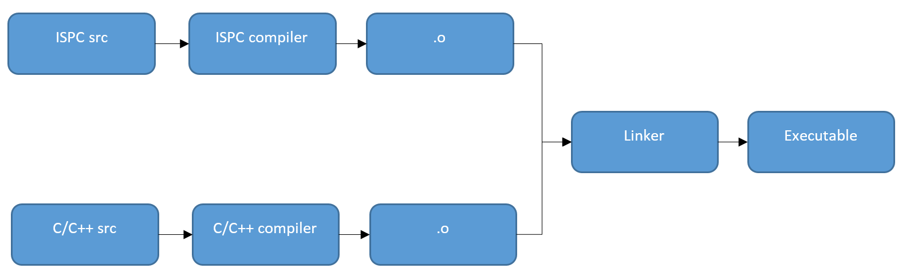
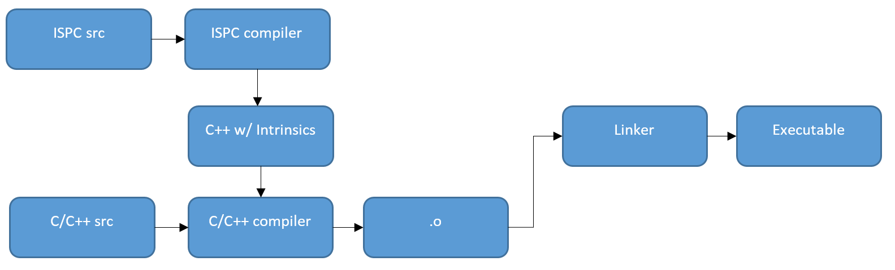

### Introduction

ISPC is a LLVM-based language and compiler that provides a SPMD programming
model for Intel SIMD architectures.

ISPC draws from GPU programming
languages, which have shown that for many applications
the easiest way to program SIMD units is to use
a single-program, multiple-data (SPMD) model, with each
instance of the program mapped to one SIMD lane.

SPMD (Single Program, Multiple Data)
Run the same program in parallel with different inputs per instance
+ Inputs are collections of data
+ Array elements
+ Pixels
+ Vertices
+ etc

One important thing is the contract: The programmer guarantees that different program instances are independent of each other then the Compiler/Runtime is free to run those instances in parallel
where is different from autovectorization, where a compiler must prove that vectorization is both possible and safe.

The most important features of ispc for performance are:  
+  Explicit language support for both scalar and SIMD
operations.
+  Support for structure-of-arrays data structures, including
for converting previously-declared data types into
structure of arrays layout.
+  Access to the full flexibility of the underlying CPU
hardware, including the ability to launch asynchronous
tasks and to perform fast cross-lane SIMD operations.

The most important features of ispc for usability are:
+ Support for tight coupling between C++ and ispc,
including the ability to directly call ispc routines from
C++ and to also call C++ routines from ispc.
2
+  Coherent shared memory between C++ and ispc.
+  Familiar syntax and language features due to its basis
in C.

ISPC basic build path diagram :

ISPC alternative build path diagram :

Upon entry to a ispc function called from C/C++ code,
the execution model switches from the application’s serial
model to ispc’s SPMD model. Conceptually, a number of
program instances start running concurrently.
